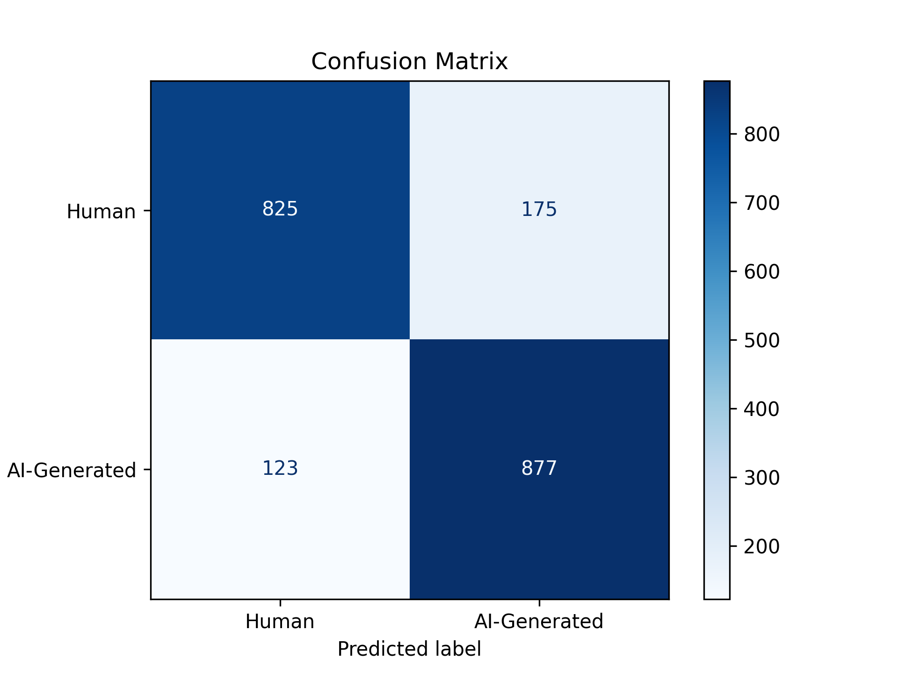

# Aegis: AI Python Code Detection Model

## Overview
Aegis is a fine-tuned CodeBERT model that classifies AI-generated and human code. CodeBERT has 125 million parameters, but using LoRA (Low-Rank Adaptation), Aegis was efficiently trained locally with only a subset of the original parameters being updated. This project sprouted out of my curiosity of classifying AI and human code off semantic differences. Hence, the dataset (20K samples: 10K AI + 10K Human) was aggressively cleaned to ensure standard formatting and the removal of comments and docstrings. The threshold was set to 0.7 to suggest that were is enough evidence to "pass" the code sample as AI-generated. Predictions by Aegis are not perfect: it's not an end all be all judge. Additionally, tasks where semantic convergence between humans and AI is observed (think LeetCode) are inherently hard to classify. 

## Installation

```bash
pip install aegis-detect
```

### CLI Usage

**Supported commands**:
```bash
# Predicting using a file
aegis --file path/to/code.py

# Predicting using text
aegis --text "def add(a, b):\n    return a + b"

# JSON output
aegis --file path/to/code.py --json > result.json

# Setting a threshold for AI classification 
aegis --file path/to/code.py --threshold 0.7

# Help
aegis --help
```

**Notes**:
- On first run, the model adapter is downloaded from the Hugging Face repo [anthonyq7/aegis](https://huggingface.co/anthonyq7/aegis) and cached under `~/.aegis/models`.
- Internet access is required on the first run; subsequent runs use local cache. 
- The CLI prints the predicted label and probabilities for human and AI.

## Key Results

### Model Performance
- **Accuracy**: 85.10%
- **Precision**: 83.37%
- **Recall**: 87.70%
- **F1-Score**: 85.48%

### Confusion Matrix


## Contact
**Email**: a.j.qin@wustl.edu

## License
This project is licensed under the [MIT License](LICENSE).
